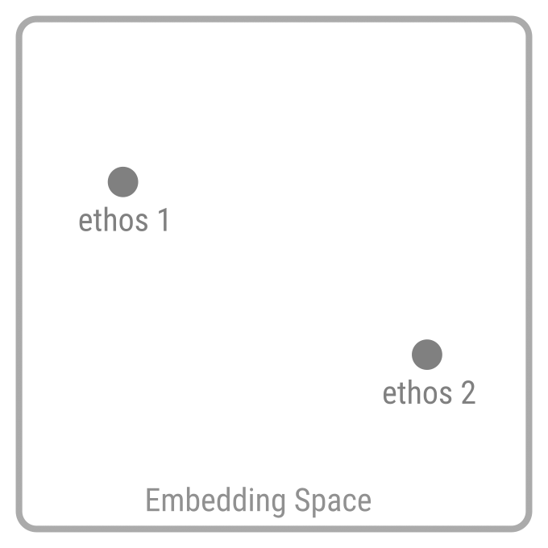

# Ethical Mediation

## Ethical Embedding Space

Let us consider the set of all ethoses as AI-tokenozeable strings. We may use an LLM (or better: an LCM) to obtain the embedded vector for all of them. We will call the space spanned by all ethos embeddings an Ethical Embedding Space.

## The Case of 2 Ethoses

If we consider 2 ethoses: "ethos 1" and "ethos 2" as 2 , embedded in the ethical embedding space: they can be understood as 2 distinct points. For a space with 2 dimensions (they would have to be in about 1000 dimensions to make this theory applicable, but we simplify to 2 to make it understandable), we can even draw them:

